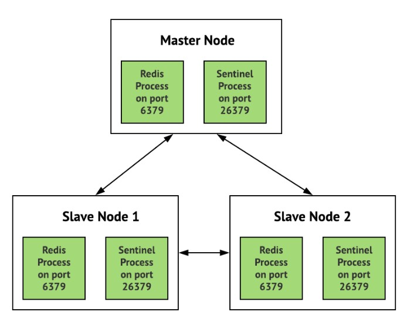
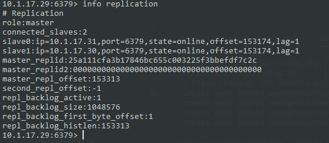
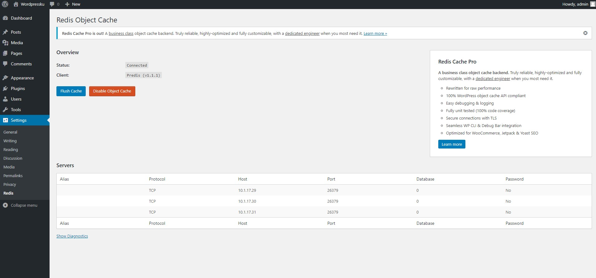
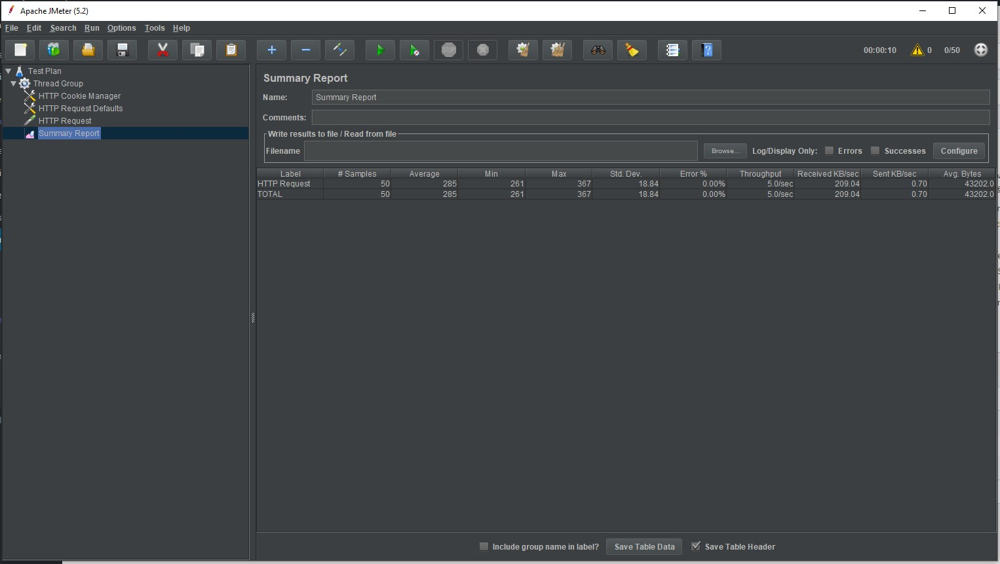
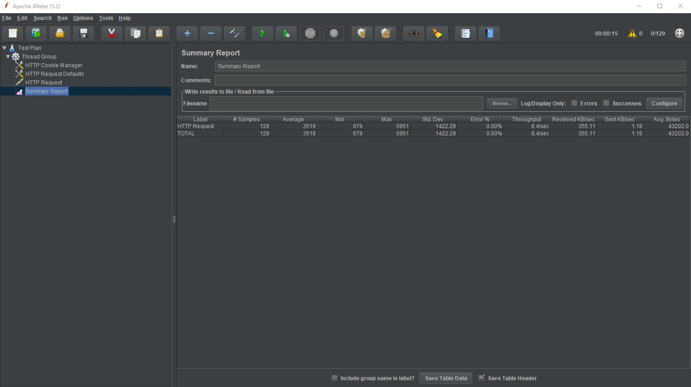
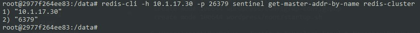

# BDT Redis 

## I. Arsitektur


Master Node : IP 10.1.17.29  
Slave Node 1 : IP 10.1.17.30  
Slave Node 2 : IP 10.1.17.31

## II. Docker Command

### Cara Menjalankan Service
```bash
docker-compose build

docker-compose --compatibility up
# atau
docker-compose --compatibility up -d
```

### Cara Menjalankan/Memberhentikan Single Service
```bash
docker-compose start <service>
docker-compose stop <service>

# contoh
docker-compose start redis_master
docker-compose stop redis_master
```

### Cara Menghancurkan Semua Service
```bash
docker-compose down
docker volume rm bdt_redis_redis_master bdt_redis_redis_slave_1 bdt_redis_redis_slave_2 bdt_redis_mysql bdt_redis_wordpress
```

## III. Cara Membuat Replikasi
1. Mengcopy default setting `redis.conf` dan `sentinel.conf` ke direktori `/etc`
    ``` bash
    cp ./redis.conf /etc/redis.conf
    cp ./sentinel.conf /etc/sentinel.conf
    ```
2. Mengganti bind ip serta port masing-masing node
    ``` bash
    bind 127.0.0.1 ${IP} # Redis
    bind 127.0.0.1 ${IP} # Sentinel
    port ${PORT} # Redis
    port ${PORT_SENTINEL} # Sentinel
    ```
3. Khusus slave node, tambahkan konfigurasi berikut pada `redis.conf`
    ```bash
    slaveof ${MASTER_IP} ${MASTER_PORT}
    ```
4. Untuk semua node, tambahkan konfigurasi berikut pada `sentinel.conf`
    ```bash
    sentinel monitor ${CLUSTER_NAME} ${MASTER_IP} ${MASTER_PORT} ${QUORUM}
    sentinel down-after-milliseconds ${CLUSTER_NAME} 5000
    sentinel parallel-syncs ${CLUSTER_NAME} 1
    sentinel failover-timeout ${CLUSTER_NAME} 10000
    ```
5. Jalankan `redis-server` dan `redis-sentinel`
    ```bash
    redis-server /etc/redis.conf &
    redis-sentinel /etc/sentinel.conf &
    ```
6. Cek replikasi berjalan atau tidak dengan cara
    ```bash
    redis-cli -h <ip_redis_master>

    info replication
    ```
    

## IV. Install Wordpress
1. Untuk mempermudah silakan menginstall wordpress di webserver milik host dengan cara download https://wordpress.org/latest.zip lalu diextract dan diletakkan pada folder `/var/www` atau `<xampp_path>\htdocs`
2. Jalankan webserver beserta mysql server, buka link `localhost/wordpress` dan ikuti tahap installasi
3. Setelah itu masuk ke plugins, download & pasang plugin https://wordpress.org/plugins/redis-cache/
4. Tambahkan konfigurasi berikut pada file `wp-config.php`
    ```php
    define( 'WP_REDIS_CLIENT', 'predis' );
    define( 'WP_REDIS_SENTINEL', 'redis-cluster' );
    define( 'WP_REDIS_SERVERS', [
        'tcp://10.1.17.29:26379',
        'tcp://10.1.17.30:26379',
        'tcp://10.1.17.31:26379',
    ] );
    ```
5. Masuk ke halaman setting plugin, lalu enable object cache
    

## V. Load Test
### Cara Penggunaan
1. Download JMeter
2. Tambahkan Thread Group, HTTP Cookie Manager, HTTP Request Defaults, HTTP Request, dan Summary Report
3. Pada HTTP Request Defaults ganti Server Name dengan lokasi wordpress yang telah diinstall
4. Pada HTTP Request pilih path dari post yang ada di wordpress
5. Jalankan testing

### Hasil Test
1. Pada sample 50   
    cache enabled
    
    cache disabled
    
    
2. Pada sample 129   
    cache enabled
    
    cache disabled
    
   
3. Pada sample 229   
    cache enabled
    
    cache disabled
    

Kesimpulan :
- Ketika menggunakan redis sebagai cache, nilai Througput, Received KB/sec, Sent KB/sec menjadi lebih kecil dari sebelumnya.

## VI. Failover
1. Matikan node master dengan cara
    ```bash
    docker-compose stop redis_master
    ```
2. Masuk ke terminal node yang masih aktif
    ```bash
    docker-compose exec redis_slave_1 bash
    ```
3. Jalankan perintah berikut pada setiap node yang masih aktif
    ```bash
    redis-cli -h <ip_node> -p <port_sentinel> sentinel get-master-addr-by-name <cluster_name>

    # contoh
    redis-cli -h 10.1.17.30 -p 26379 sentinel get-master-addr-by-name redis-cluster
    ```
    